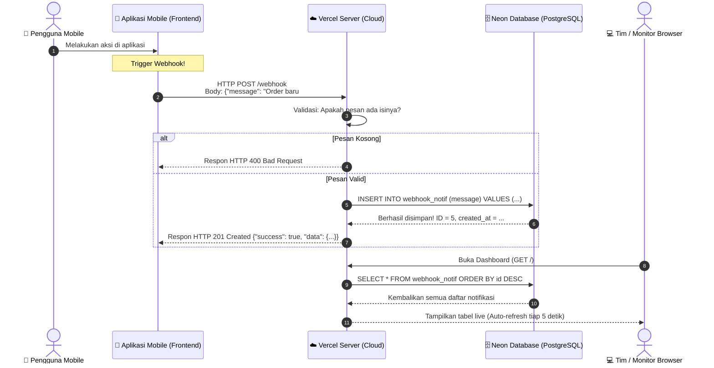

# 📬 Webhook Server — Dokumentasi Lengkap & Panduan Presentasi

> **Tugas / Job**: Membuat Webhook Server menggunakan endpoint `POST` untuk menerima kiriman data dari aplikasi mobile tim Frontend, menyimpannya ke tabel database `webhook_notif` dengan susunan `[id, message, created_at]`, serta dapat diakses secara online 24/7 di internet agar mudah di-demo dan dipelajari bersama.

---

## 🌟 Ringkasan Hasil Akhir

| Komponen | Status & Link |
| :--- | :--- |
| **Endpoint Webhook (Cloud 24/7)** | `POST https://webhook-server-sand.vercel.app/webhook` |
| **Live Web Dashboard** | [https://webhook-server-sand.vercel.app](https://webhook-server-sand.vercel.app) *(Aktif 24 jam)* |
| **Database Cloud** | **Neon PostgreSQL** (Tabel `webhook_notif`) |
| **Hosting Cloud** | **Vercel** *(100% Gratis, Tanpa Kartu Kredit, Selalu Menyala)* |
| **Opsi Server Lokal (Laptop)** | `START.bat` + Ngrok Static Domain |
| **Repository GitHub** | [https://github.com/marshadwi/webhook-server](https://github.com/marshadwi/webhook-server) |

---

## 📖 Kamus Istilah untuk Pemula (Artinya Apa?)

Biar saat presentasi kamu paham dan bisa menjelaskan ke semua orang dengan bahasa yang mudah:

| Istilah | Apa Artinya Secara Sederhana? |
| :--- | :--- |
| **Webhook** | **"Bel Pintu Otomatis"** 🔔. Tanpa webhook, server harus terus-menerus bertanya ke HP *"Ada pesan baru gak?"* (boros baterai & kuota). Dengan webhook, aplikasi mobile yang **aktif mengirim pesan ke server** begitu ada event/kejadian baru. |
| **Endpoint** | **"Alamat Rumah / Loket Tujuan"** 📍. Contoh: `/webhook` adalah loket khusus untuk menerima titipan notifikasi. |
| **HTTP POST** | **"Aksi Mengirim / Menitipkan Data"** 📦. Berbeda dengan `GET` (yang hanya melihat/mengambil), `POST` digunakan saat kita ingin memasukkan data baru ke server. |
| **JSON (Request Body)** | **"Bentuk Surat / Amplop Data"** ✉️. Format standar pertukaran data yang rapi dan mudah dibaca oleh semua bahasa pemrograman (contoh: `{"message": "Halo"}`). |
| **Status 201 Created** | **"Surat Berhasil Disimpan"** ✅. Kode standar dunia web yang menandakan data baru berhasil masuk dan tercatat di database. |
| **Status 400 Bad Request** | **"Surat Ditolak Karena Tidak Lengkap"** ❌. Contohnya jika aplikasi mobile mengirimkan data kosong tanpa pesan. |
| **Neon PostgreSQL** | **"Buku Catatan Digital di Awan (Cloud DB)"** ☁️. Database asli berbasis SQL di internet, jadi data notifikasi tidak akan hilang meskipun laptop dimatikan. |
| **Vercel (Serverless)** | **"Komputer Server 24 Jam Tanpa Henti"** 🚀. Layanan cloud yang menjalankan kode kita di internet tanpa perlu sewa komputer fisik. |
| **Tunneling (Ngrok)** | **"Terowongan Rahasia"** 🚇. Menghubungkan laptop lokal ke internet publik untuk keperluan uji coba di laptop. |

---

## 🏗️ Alur Kerja Sistem (Architecture Workflow)



---

## 🗂️ Bedah Lengkap Setiap File di Project

Berikut penjelasan file-file yang ada di dalam folder `webhook-server`:

### 1. `server.js` (Otak Server Express)
- Mengatur jalur lalu lintas URL (**Routing**).
- **`app.post('/webhook')`**: Menerima request POST dari tim mobile, mengecek isi pesannya, memanggil fungsi simpan di database, lalu mengembalikan status 201.
- **`app.get('/')`**: Menghasilkan halaman web HTML monitor yang menampilkan tabel notifikasi dan otomatis me-refresh setiap 5 detik.
- **`app.get('/webhook')`**: Endpoint untuk mengambil semua riwayat notifikasi dalam bentuk data JSON mentah.
- **`app.delete('/webhook/reset')`**: Tombol reset untuk membersihkan database saat ingin demo ulang dari awal.

### 2. `database.js` (Jembatan ke Database PostgreSQL Neon)
- Menggunakan library `pg` (PostgreSQL Client).
- Membuka koneksi aman via SSL ke **Neon Cloud**.
- Menjalankan perintah SQL:
  - Membuat tabel otomatis: `CREATE TABLE IF NOT EXISTS webhook_notif` dengan kolom:
    - **`id`** (`SERIAL PRIMARY KEY`): Nomor urut otomatis (1, 2, 3, ...).
    - **`message`** (`TEXT NOT NULL`): Teks isi notifikasi dari tim mobile.
    - **`created_at`** (`TIMESTAMPTZ DEFAULT NOW()`): Waktu otomatis saat server menerima data.

### 3. `api/index.js` (Pintu Gerbang Vercel Serverless)
- File perantara resmi agar Vercel dapat menjalankan aplikasi Express kita sebagai *Serverless Function* (langsung aktif dalam hitungan milidetik saat ada request masuk).

### 4. `vercel.json` (Petunjuk Jalan Vercel)
- Memberitahu Vercel bahwa semua URL apapun (`/*`) harus diarahkan ke pintu `api/index.js`.

### 5. `package.json` (Daftar Belanja Kebutuhan Library)
- Mendefinisikan paket-paket yang dipakai:
  - `express`: Framework web server.
  - `pg`: Driver untuk menghubungkan Node.js ke PostgreSQL.
  - `cors`: Izin agar server bisa diakses dari HP / aplikasi beda domain.
  - `dotenv`: Pembaca file `.env`.

### 6. `.env` (Brankas Rahasia)
- Berisi URL koneksi database Neon (`DATABASE_URL`) dan token Ngrok. File ini dijaga di laptop dan tidak di-upload ke publik demi keamanan keamanan sandi database.

### 7. `START.bat` (Tombol Nyala Cepat di Laptop)
- File batch Windows. Cukup dobel-klik file ini jika suatu saat ingin menyalakan server lokal di komputer tanpa repot mengetik perintah terminal.

---

## 📱 Panduan Resmi untuk Tim Frontend Mobile

Kirimkan spesifikasi ini kepada rekan tim mobile yang membuat aplikasi:

### 1. URL Endpoint
```http
POST https://webhook-server-sand.vercel.app/webhook
```

### 2. Header Wajib
```http
Content-Type: application/json
```

### 3. Pilihan Format Body Request (Semua Format Diterima Otomatis)

Server ini dirancang sangat fleksibel untuk berbagai tingkatan anggota tim frontend yang sedang belajar:

#### 🔹 Pilihan A: Format Pesan Sederhana (Untuk Pemula)
Cocok untuk yang baru pertama kali belajar POST HTTP:
```json
{
  "message": "Halo! Saya tim frontend pemula sedang belajar webhook."
}
```

#### 🔹 Pilihan B: Format Transaksi E-Wallet / QRIS (Lengkap)
Cocok untuk aplikasi listener e-wallet (DANA, ShopeePay, GoPay, BCA, dll):
```json
{
  "appSource": "DANA",
  "amount": 50000.0,
  "formattedAmount": "Rp 50.000",
  "payerName": "BUDI SANTOSO",
  "type": "qris_in",
  "dateTime": "2026-09-10T09:46:22",
  "rawMessage": "DANA\nKamu menerima Saldo DANA sebesar Rp 50.000 dari BUDI SANTOSO"
}
```

#### 🔹 Pilihan C: Format JSON Bebas (Custom Frontend)
Cocok untuk frontend yang mengirimkan data apapun:
```json
{
  "user": "Andi",
  "action": "checkout_berhasil",
  "total": 125000
}
```
*(Server otomatis mendeteksi apakah data berupa teks biasa atau JSON lengkap, dan menyimpannya secara rapi ke PostgreSQL!)*

### 4. Contoh Response Sukses (HTTP 201 Created)
```json
{
  "success": true,
  "message": "✅ Webhook berhasil diterima dan disimpan!",
  "data": {
    "id": 5,
    "message": "Transaksi berhasil: ID #TRX-99823 oleh Budi",
    "created_at": "2026-09-10T02:52:48.924Z"
  }
}
```

### 5. Contoh Response Error jika Pesan Kosong (HTTP 400 Bad Request)
```json
{
  "success": false,
  "error": "Field \"message\" wajib diisi!",
  "contoh": {
    "message": "Halo dari aplikasi mobile!"
  }
}
```

---

## 🎬 Panduan Cara Presentasi & Skenario Demo

Saat mempresentasikan hasil kerjamu di hadapan tim, mentor, atau penguji, ikuti alur ini:

### Langkah 1: Buka Dashboard Monitor di Layar Proyektor / Screen Share
Buka link: 👉 **[https://webhook-server-sand.vercel.app](https://webhook-server-sand.vercel.app)**
> *"Halo semuanya, ini adalah Webhook Monitor yang sudah saya buat dan deploy 24/7 di cloud Vercel, terhubung ke database cloud PostgreSQL Neon."*

### Langkah 2: Jelaskan Struktur Database
Tunjukkan bahwa tabel memiliki susunan sesuai spesifikasi:
- **`id`**: Penomoran unik otomatis.
- **`message`**: Data teks notifikasi kiriman dari mobile.
- **`created_at`**: Timestamp waktu notifikasi masuk.

### Langkah 3: Lakukan Live Demo Pengiriman Webhook
Buka aplikasi **Postman**, **Thunder Client**, atau terminal **PowerShell / curl**:
```bash
curl -X POST https://webhook-server-sand.vercel.app/webhook \
  -H "Content-Type: application/json" \
  -d "{\"message\": \"Halo! Ini demo live saat presentasi!\"}"
```

### Langkah 4: Tunjukkan Dashboard yang Berubah Otomatis!
Lihat kembali ke halaman dashboard browser. Dalam 5 detik, data baru yang baru saja dikirim akan **langsung muncul di baris paling atas secara otomatis** tanpa perlu refresh manual! ✨

### Langkah 5: Jelaskan Keunggulan Sistem
- **Always-On (Aktif 24/7)**: Biarpun laptop server dimatikan, tim mobile tetap bisa menembak API kapan saja.
- **Persistent Data**: Data tidak hilang saat restart karena tersimpan di Neon Cloud PostgreSQL.
- **Aman & Tervalidasi**: Request kosong otomatis ditolak dengan pesan error yang jelas.
